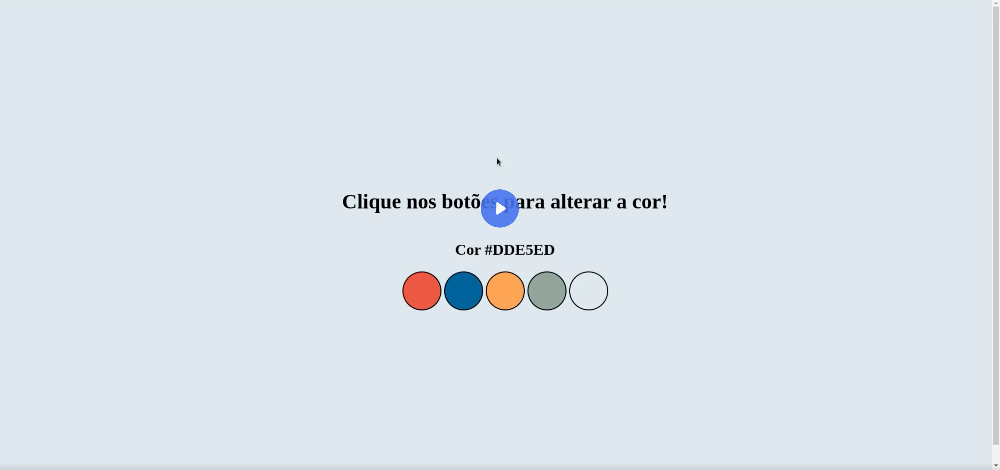

# Altera Fundo

  </img>

## O que é este projeto
Este projeto é uma pagina feita com HTML, CSS e Javascript que contém uma série de botōes coloridos para que a pessoa que está utilizando a aplicacao possa alterar a cor de fundo da página.

## Como rodar este projeto
Para rodar este projeto bastar dar dois cliques no arquivo *index.html* uma vez que a pasta do projeto esteja aberta no sistema de arquivo do seu sistema operacional.

Alternativamente, você também pode utilzar a extensão [Live Server](https://marketplace.visualstudio.com/items?itemName=ritwickdey.LiveServer) da IDE Visual Studio Code para rodar o projeto.

## Como usar este projeto
Uma vez que a aplicação que esteja rodando, você pode clicar nos círculos  coloridos que são mostrados na página para alterar a cor de fundo da página. A cor será alterada de acordo com o botão que você pressionar.

## Tecnologias usadas no projeto
- HTML
- CSS
- Javascript

## Features do Projeto
- 5 botōes com cores diferentes que alteram a cor de fundo da página.
- Subtítulo que é atualizado conforme a cor atual da página.

## Como este projeto está organizado
Na pasta raiz do projeto, existem três arquivos de código:
- index.html -> contém o html da aplicação.
- style.css -> contém o estilo da aplicação.
- script.js -> contém o código Javascript da aplicação.

## Como este projeto foi implementado
Este projeto foi implementado com HTML, CSS e Javascript.

No Javascript os botōes definidos no HTML são capturados através de um getElementsByTagName e é adcionado um event listener a cada um desses botōes.

Ao clicar em um botão, é disparado um evento que irá alterar a cor de fundo da página e o título de segunda importância será atualizado com o código da cor, que está armazenado em um array.

## Depedências Principais
Não temos depedências no projeto.

## Links úteis
- [Paleta de cores](https://coolors.co/palette/d94e33-2c5697-ed9b33-8a9b8e-2d2926-f4e5de-dde5ed-f8f1e0-d7d2cd-dfdede)

## Como contribuir com o projeto
[Clique aqui](./CONTRIBUTING.md) para ver as diretrizes de contribuição

## Pessoas que contribuiram com o projeto
- [Gabrielle](https://github.com/VillaGabe) - mantedora do projeto.
- [Gabrielle1](https://github.com/VillaGabe) - contribuinte
- [Gabrielle2](https://github.com/VillaGabe) - contribuinte

## Precisa de ajuda?
Você pode contatar a Gabrielle (mantedora do projeto) pelo email gabe.gabe@legal.com.es
